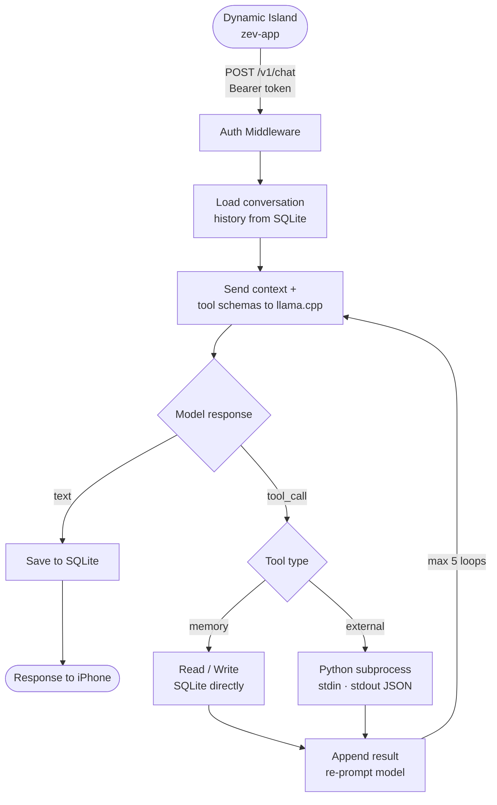

# Zev

Zev is a fully local AI assistant built on Apple Silicon. A Rust server runs on your Mac, manages a local language model, persists memory in SQLite, and executes tools when the model needs real-world information. The interface lives in the Dynamic Island on your iPhone always within reach, never in the way. No cloud. No data leaving your machine.

---

## How it works



---

## Tools

When the model needs real-world information it emits a `tool_call`. zev-core runs the tool, feeds the result back, and reprompts. The client never sees the intermediate steps.

| Tool | Runtime | What it does |
|------|---------|-------------|
| `remember` | Rust | Writes a key/value memory to SQLite |
| `recall` | Rust | Queries stored memories before responding |
| `system_status` | Python | Returns CPU, RAM, and disk usage |
| `fetch_url` | Python | Fetches a URL and returns readable text |

---

## Memory

Conversations are stored in SQLite with full message history across sessions. Explicit memories facts, preferences, anything you tell Zev to remember live in a separate table and persist indefinitely across all conversations.

---

## Repo

```
zev/
├── core/          Rust · Axum · Tokio · sqlx
├── app/           Swift · SwiftUI · ActivityKit
├── tools/         Python tool scripts
└── migrations/    SQLite schema
```

---

## Stack

| | |
|---|---|
| Server | Rust · Axum · Tokio |
| Inference | llama.cpp · Metal |
| Storage | SQLite · sqlx |
| Tools | Python 3 |
| Client | Swift · SwiftUI · ActivityKit |

---

## Status

Early development. V1 goal a complete working loop: message in, model responds, tools execute, memory persists. Streaming, voice, and cross device follow after the foundation is solid.
